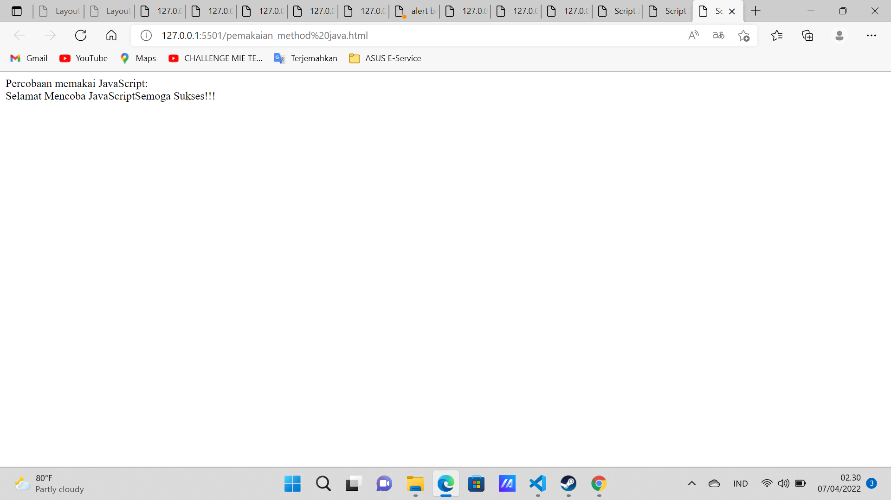
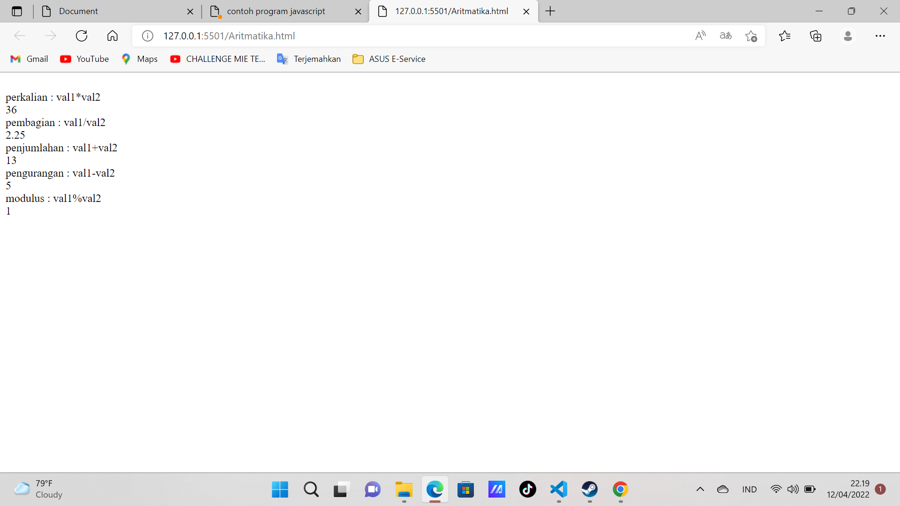
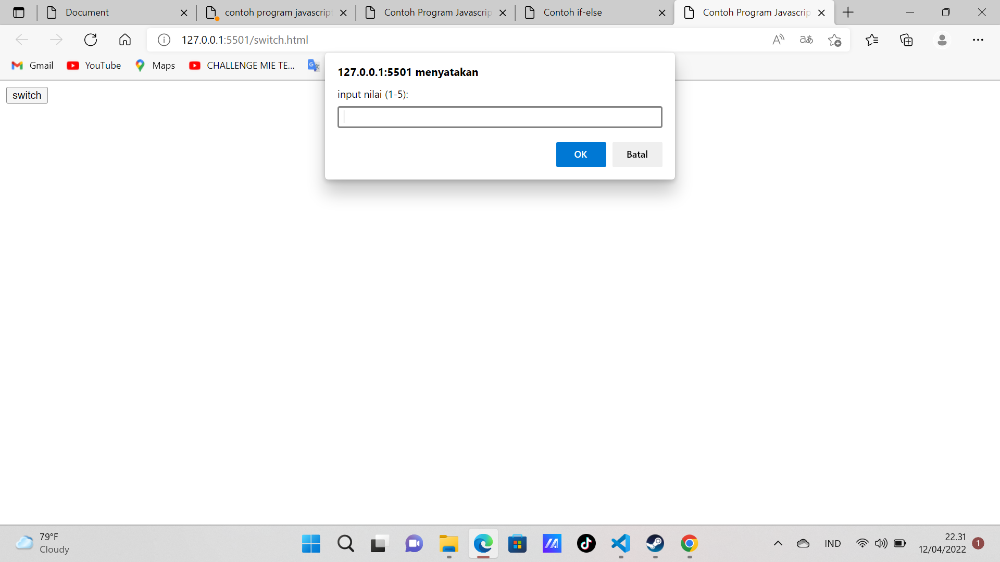
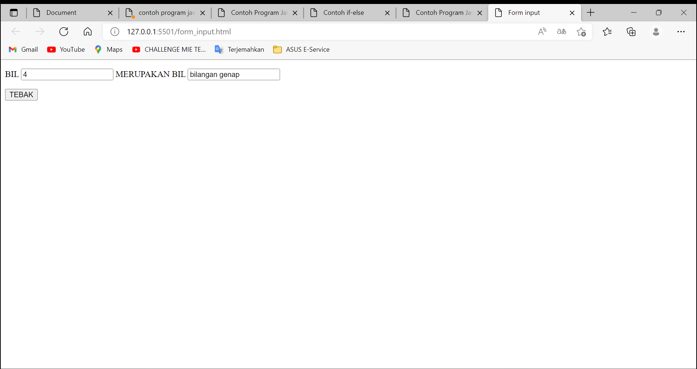
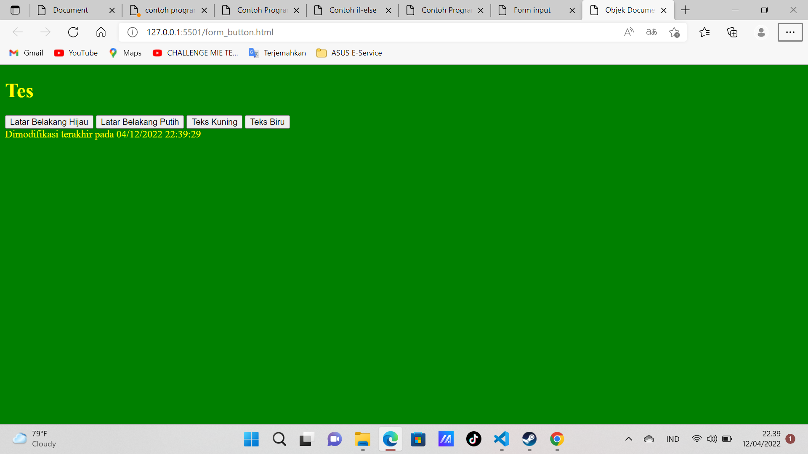
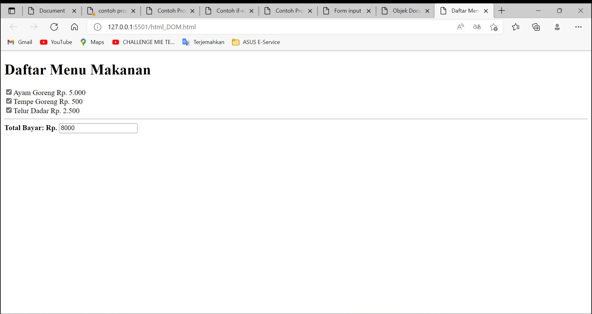

| AHMAD ALFIAN CHANDRA      | 312010336             |
| ----------------------    | -----------------     |
| TI.20.A2                  | PEMROGRAMAN WEB       |
| PRATIKUM 4                | PERTEMUAN 5           |

## PERTEMUAN 6

## lab5_javascript

Di pertemukan kali ini mari kita membahas tentang pengenalan javascipt

## 1) Pengenalan JavaScript

## CONTOH TAMPILANNYA

**PENJELASAN**
Menambahkan penampilan pengenalan javascript dasar

**__________________________________________________________________________________________________________________________**

# JavaScript Dasar

## 1) Pemakaian alert sebagai property window

## CONTOH TAMPILANNYA

**PENJELASAN**
Menambahkan Alert sebagai poperty window

## 2) Pemakaian method dalam objek

## CONTOH TAMPILANNYA

**PENJELASAN**
Menambahkan Method dalam JavaScript

## 3) Pemakaian Prompt

## CONTOH TAMPILANNYA

**PENJELASAN**
Menambahkan Prompt

**PENJELASAN** 
Gambar di atas merupakan hasil dari setelah anda memasukan nama anda.

## 4) Pembuatan Fungsi

**PENJELASAN**
Menambahkan Fungsi

## 5) Operasi Dasar Aritmatika

**PENJELASAN**
Menambahkan Operasi dasar aritmatika

## 6) Seleksi kondisi if else

**PENJELASAN**
Menambahkan Seleksi Kondisi if else

**PENJELASAN**
Berikut adalah hasil setelah memasukan angka di seleksi if else

## 7) Penggunaan Operator switch untuk seleksi kondisi

**PENJELASAN**
Menambahkan operator switch untuk seleksi kondisi

**PENJELASAN**
Berikut adalah hasil setelah memasukan di input an switch

## 8) Pembuatan Form Input

**PENJELASAN**
Menambahkan form input

## 9) Pembuatan Form Button

**PENJELASAN**
Menambahkan Form Button

## 10) HTML DOM

**PENJELASAN**
Menambahkan HTML DOM
